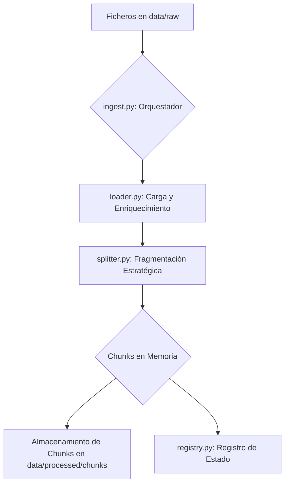

# Arquitectura del Sistema de Ingesta de Datos

## 1. Visión General

El sistema de ingesta es un pipeline de tipo **ETL (Extract, Transform, Load)** diseñado específicamente para preparar documentos para una aplicación de **Generación Aumentada por Recuperación (RAG)**. Su objetivo principal es procesar un conjunto de ficheros fuente (`data/raw`), transformarlos en fragmentos de texto manejables (`chunks`) y registrar el estado del proceso para garantizar la eficiencia y la idempotencia.

El flujo de trabajo es orquestado por el script principal `src/ingest.py` y se apoya en un conjunto de módulos especializados dentro del paquete `src/ingestion`.

## 2. Diagrama Conceptual del Flujo



## 3. Componentes Principales

A continuación, se detalla la responsabilidad de cada componente clave del sistema.

### 3.1. `src/ingest.py`: El Orquestador

Este es el punto de entrada y el cerebro del pipeline. Sus responsabilidades son:

- **Gestión de Argumentos de CLI**: Procesa comandos como `--reset`, `--clear` y `--force` para controlar el comportamiento del pipeline (limpiar, re-procesar, etc.).
- **Iteración de Ficheros**: Recorre el directorio `data/raw`, identificando los ficheros a procesar.
- **Coordinación de Módulos**: Invoca secuencialmente al `IngestionLoader` y al `IngestionSplitter`.
- **Gestión del Estado**: Interactúa con el `IngestionRegistry` para determinar si un fichero necesita ser procesado, basándose en su hash de contenido.
- **Persistencia de Chunks**: Guarda los `chunks` generados como ficheros JSON individuales en `data/processed/chunks/`.
- **Manejo de Errores**: Utiliza bloques `try/except` para aislar fallos en el procesamiento de un fichero sin detener todo el pipeline.

### 3.2. `src/ingestion/loader.py`: Carga y Enriquecimiento de Datos

Este módulo se encarga de la fase de **Extracción (Extract)**.

- **Patrón Factory (`DataLoaderFactory`)**: Implementa un patrón de diseño *Factory* que selecciona dinámicamente la clase de `langchain_community.document_loaders` apropiada según la extensión del fichero (`.pdf`, `.py`, `.txt`, etc.). Esto lo hace fácilmente extensible a nuevos formatos.
- **Carga de Contenido**: Utiliza la librería LangChain para leer el contenido de los ficheros y convertirlo en una lista de objetos `Document`.
- **Enriquecimiento de Metadatos**: Tras la carga, enriquece cada documento con metadatos cruciales:
    - `source_id`: Un **hash SHA256** del contenido del fichero. Actúa como un identificador único e inmutable de la versión del fichero.
    - `file_name`, `file_type`, `parent_folder`: Metadatos básicos para trazabilidad.
    - `category`: Una clasificación simple (ej. `code_snippet` o `documentation`) basada en el tipo de fichero, útil para filtrados posteriores.

### 3.3. `src/ingestion/splitter.py`: Fragmentación Estratégica (Chunking)

Este módulo realiza la fase de **Transformación (Transform)**, que es crítica para RAG.

- **Necesidad del Chunking**: Los modelos de lenguaje tienen un límite de contexto. El "chunking" consiste en dividir los documentos largos en fragmentos más pequeños y semánticamente coherentes. Estos `chunks` son las unidades que se convertirán en vectores (embeddings) y se recuperarán durante la fase de inferencia.
- **Selección de Estrategia**:
    - **Código Fuente (`.py`, `.java`)**: Utiliza `RecursiveCharacterTextSplitter.from_language`, que está optimizado para respetar la sintaxis del código (funciones, clases, etc.), generando `chunks` más coherentes.
    - **Texto Genérico**: Para otros formatos, usa un `RecursiveCharacterTextSplitter` estándar que divide el texto por párrafos, saltos de línea y otros separadores comunes.
- **Configuración Flexible**: El tamaño de los `chunks` (`chunk_size`) y el solapamiento entre ellos (`chunk_overlap`) se configuran a través de variables de entorno, permitiendo un ajuste fino sin modificar el código.
- **Metadatos de Chunk**: Añade un `chunk_index` a cada `chunk` para mantener su orden secuencial relativo al documento original.

### 3.4. `src/ingestion/registry.py`: Registro de Estado

Este componente proporciona **idempotencia** y **eficiencia** al pipeline.

- **Persistencia de Estado**: Mantiene un fichero JSON (`data/processed/ingestion_state.json`) que actúa como un registro de los ficheros procesados.
- **Verificación Basada en Hash**: Para cada fichero, el orquestador compara el hash de su contenido actual con el hash almacenado en el registro. Si coinciden, el fichero se omite, evitando una re-computación costosa. Si no coinciden (o el fichero es nuevo), se procesa.
- **Gestión del Ciclo de Vida**: Proporciona métodos para registrar un fichero (`register_file`), verificar su estado (`is_file_processed`) y limpiar el registro por completo (`clear_registry`).

## 4. Estructura de Directorios Relevante

```
/
├── data/
│   ├── raw/                  # Ficheros fuente a ser procesados.
│   └── processed/
│       ├── chunks/           # Chunks materializados como ficheros JSON.
│       └── ingestion_state.json # Registro de estado del pipeline.
├── docs/
│   └── ARQUITECTURA_INGESTA.md # Este documento.
└── src/
    ├── ingestion/
    │   ├── loader.py
    │   ├── registry.py
    │   └── splitter.py
    └── ingest.py             # Orquestador principal.
```

## 5. Próximos Pasos y Escalabilidad

El estado actual del sistema materializa los `chunks` en disco. El siguiente paso lógico es reemplazar este almacenamiento intermedio por la carga en una **Base de Datos Vectorial** (Vector DB). Esto implicaría:

1.  **Generación de Embeddings**: Convertir el `page_content` de cada `chunk` en un vector numérico usando un modelo de embeddings.
2.  **Carga en Vector DB**: Insertar el `chunk` (contenido y metadatos) junto con su embedding en una base de datos como ChromaDB, FAISS, o similar.

La arquitectura actual, al ser modular, facilita esta extensión. Solo se necesitaría añadir un nuevo componente (ej. `VectoreStoreLoader`) y llamarlo desde el orquestador `ingest.py` después de la fase de `split_documents`.